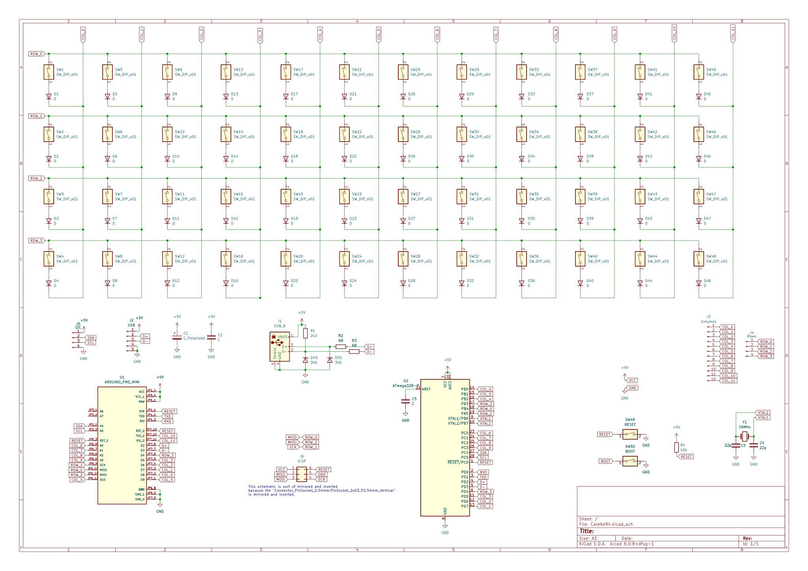

# Calebe94's Keyboard

This keyboard is inspired by [Plaid](https://github.com/AntonioPelayo/plaid-through-hole-keyboard) and [Gherkin Apls 1.1](https://www.40percent.club/2017/08/gherkin-alps-11.html).

I'm using white APLS switches for this project and Arduino Pro Mini as the core microcontroller.

## Symbols and Footprints

* I'm using an slightly modded version of [ARDUINO PRO MINI](https://www.snapeda.com/parts/Arduino%20Pro%20Mini/Arduino/view-part/?t=arduino+pro+mini&welcome=home) from [SnapEDA](https://www.snapeda.com). (I've just added a couple of pins at the bottom at the board because my PRO Mini uses the TQFP and QFN/MLF package of the ATMEGA328p);
* For the ALPS switches and the diodes I'm using the [keyboard_parts.pretty](https://github.com/tmk/keyboard_parts.pretty) footprints;
* As for the rest I'm using the KiCAD's stock footprints.

## Schematic

# License

All software is covered under [GNU General Public License v3.0](https://www.gnu.org/licenses/gpl-3.0.en.html).
